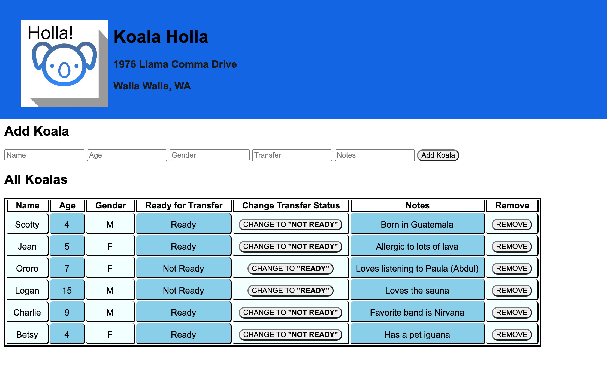
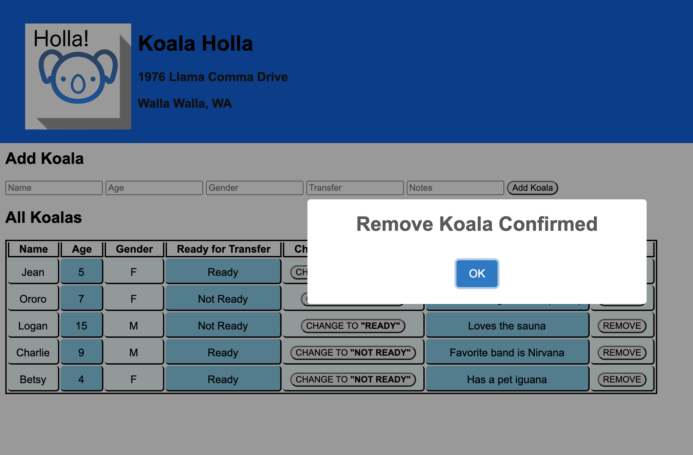

# Koala Holla 

## Description

_Duration: 2 day Group Sprint_

This is a Prime Academy group project. Four fullstack engineering students created a web application for a fictitious client named Koala Holla (1976 Llama Comma Drive, Walla Walla WA) that transports koalas from the outdoors to other enviroments.

This web application is able to input new koalas into the existing database, mark koalas that are ready for transfer, and delete koalas from the database.

The group of students worked on pair coding and organizing of equal work. Students also worked together remotely to plan and review several pull requests. Lastly, the students focused on AJAX methodology using GET, PUT, POST, and DELETE requests to communicate between the server and client.

## Screen Shot

Technologies
------------
* JQuery
* Node
* Express
* SQL
* Postico
* PostGres

## Installation

1. Fork this repositiory and clone it on your computer.
2. Open the repository in a code editor like VS Code.
3. Open up your editor of choice and run `npm install` and `npm install body-parser`.
4. Open up Postico and create a new database called `Koala` and enter the SQL commands in the database.sql file to create a table and insert the data.
5. Run `npm start` in your terminal
6. Go to your browser of choice and enter `localhost:5000` for the URL.

## Usage

The client Koala Holla can use this web application to keep track of their current koalas, update the ones that are ready for transfer, and add new koalas to their organization.

## Acknowledgement
Thanks to [Prime Digital Academy](www.primeacademy.io) who equipped and helped us to make this application a reality. 

